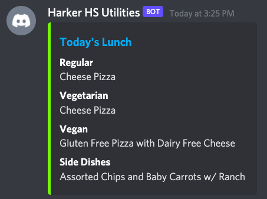
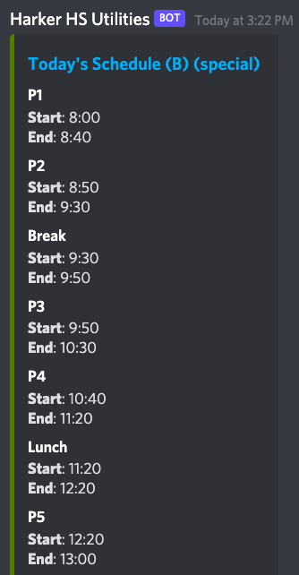

# Harker HS Utilities Bot
A discord bot that shows today's school lunch and schedule, built by Aarav Borthakur.

## Invite
[Invite link](https://discord.com/oauth2/authorize?scope=bot&client_id=848060174655553587).

## Usage
After inviting this bot, type `!harker lunch` for the day's lunch and `!harker schedule` for the day's schedule.

## Example

## Hosting locally
Clone this repository.

    $ git clone https://github.com/gadhagod/Harker-Utilities-Bot

Set bot token.

    $ export HARKER_HS_BOT="<token>"

Install dependencies.

    $ npm install

Build javascript and run bot.

    $ npm start
